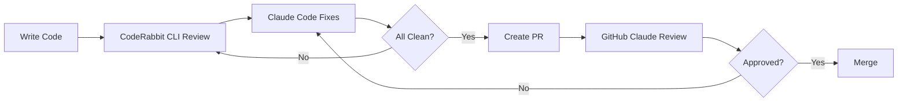

# AI-Powered Development Workflows

ScopeShield uses two AI integrations for autonomous development with built-in quality gates:

1. **GitHub Claude Review** - Automated PR reviews
2. **CodeRabbit CLI + Claude Code** - Autonomous development workflow

## Overview



## 1. CodeRabbit CLI + Claude Code

**Purpose**: Autonomous development with instant feedback

**When**: During feature implementation

**Setup**: [CODERABBIT_INTEGRATION.md](CODERABBIT_INTEGRATION.md)

### Quick Setup

```bash
# Install CodeRabbit CLI
curl -fsSL https://cli.coderabbit.ai/install.sh | sh
source ~/.zshrc

# Or use the setup script
./scripts/setup-coderabbit.sh

# Authenticate in Claude Code
# Ask Claude: Run: coderabbit auth login
```

### Example Workflow

```bash
# In Claude Code
Implement the export feature from specs/003-export/spec.md.
Run coderabbit --prompt-only --type all in the background.
Fix all issues found.
Verify accuracy ≥75% and performance <500ms.
Create PR when clean.
```

**Claude will**:
1. Implement the feature
2. Run CodeRabbit analysis (7-30 min)
3. Fix all issues automatically
4. Verify metrics
5. Create PR

### Common Commands

```bash
# Quick pre-commit check
Run coderabbit --prompt-only --type uncommitted and fix critical issues

# Full review before PR
Run coderabbit --prompt-only --base main and fix all findings

# Constitutional validation
Run coderabbit and verify all 8 constitutional principles
```

## 2. GitHub Claude Review

**Purpose**: Final validation before merge

**When**: On pull request creation/update

**Setup**: [SETUP_CLAUDE_REVIEW.md](SETUP_CLAUDE_REVIEW.md)

### Quick Setup

```bash
# Use the setup script
./scripts/setup-claude-review.sh

# Or manually:
# 1. Get Anthropic API key
# 2. Add to GitHub secrets as ANTHROPIC_API_KEY
# 3. Enable GitHub Actions write permissions
```

### What Gets Reviewed

Every PR is checked for:
- ✅ Constitutional compliance (8 principles)
- ✅ Security vulnerabilities
- ✅ Performance regressions
- ✅ Gmail integration stability
- ✅ Detection accuracy
- ✅ Test coverage

## Comparison

| Feature | CodeRabbit CLI | GitHub Claude |
|---------|----------------|---------------|
| **Stage** | Development | PR Review |
| **Execution** | Claude Code | GitHub Actions |
| **Speed** | 7-30 minutes | 30-60 seconds |
| **Scope** | All changes | PR changes |
| **Fixes** | Autonomous | Manual |
| **Cost** | Included in plan | Per review |
| **Best For** | Implementation | Final validation |

## Integrated Workflow

### Phase 1: Development (CodeRabbit CLI)

```bash
# 1. Start feature
git checkout -b feature/export-orders

# 2. Ask Claude for autonomous implementation
Implement export feature:
- Read specs/003-export/spec.md
- Implement the feature
- Run CodeRabbit in background
- Fix all issues
- Create PR when clean

# 3. Claude executes full cycle
# (implementing... analyzing... fixing... verifying...)

# 4. PR created automatically
```

### Phase 2: Review (GitHub Claude)

```bash
# Automatic on PR creation:
# - GitHub Claude review starts
# - Validates against constitution
# - Checks security, performance
# - Provides feedback

# If issues found:
# - Address feedback
# - Push changes
# - Re-review automatic

# When approved:
# - Merge PR
```

## Constitutional Enforcement

Both systems enforce the 8 core principles:

| Principle | CodeRabbit | GitHub Claude |
|-----------|------------|---------------|
| Privacy-First | ✅ Blocks data transmission | ✅ Validates storage usage |
| Simplicity-First | ✅ Flags dependencies | ✅ Checks bundle size |
| Performance | ✅ Measures latency | ✅ Enforces <500ms |
| Zero Infrastructure | ✅ Blocks API calls | ✅ Validates manifest |
| User Value | ℹ️ Suggests improvements | ✅ Validates spec |
| Chrome Compliance | ✅ Checks permissions | ✅ Enforces Manifest V3 |
| Measurable Success | ✅ Runs accuracy tests | ✅ Validates metrics |
| Graceful Degradation | ✅ Checks fallbacks | ✅ Validates error handling |

## Best Practices

### During Development (CodeRabbit)

1. ✅ Run reviews in background: "let it take as long as needed"
2. ✅ Use `--type uncommitted` for quick checks
3. ✅ Let Claude fix issues autonomously
4. ✅ Verify metrics after fixes
5. ✅ Create PR only when clean

### Before PR (Both)

1. ✅ Run full CodeRabbit review: `--type all --base main`
2. ✅ Address all critical/high issues
3. ✅ Verify constitutional compliance
4. ✅ Run tests: `npm test`
5. ✅ Build: `npm run build`

### During PR Review (GitHub Claude)

1. ✅ Fill out PR template completely
2. ✅ Address bot feedback promptly
3. ✅ Re-run tests after changes
4. ✅ Request re-review when ready
5. ✅ Merge only after approval

## Troubleshooting

### CodeRabbit Takes Too Long

**Problem**: Review running 30+ minutes

**Solutions**:
1. Review smaller changesets: `--type uncommitted`
2. Use feature branches vs main
3. Break large features into chunks
4. Ensure background execution enabled

### GitHub Review Not Running

**Problem**: No review on PR

**Solutions**:
1. Check Actions permissions enabled
2. Verify ANTHROPIC_API_KEY secret exists
3. Check workflow file syntax
4. Review GitHub Actions logs

### Too Many Review Comments

**Problem**: Overwhelmed by feedback

**Solutions**:
1. Fix critical issues first (🚨, ⚠️)
2. Group related fixes together
3. Use CodeRabbit first (catches more early)
4. Address issues before creating PR

## Cost Optimization

### CodeRabbit CLI
- **Cost**: Included in paid plans
- **Optimize**: Review uncommitted first, use path filters
- **Batch**: Group changes to reduce review cycles

### GitHub Claude
- **Cost**: ~$0.01-0.30 per PR
- **Optimize**: Limit files reviewed, aggregate comments
- **Reduce**: Fix issues with CodeRabbit first

## Success Metrics

Track these to measure workflow effectiveness:

1. **Pre-PR Issue Catch Rate**: Issues caught by CodeRabbit before PR
2. **PR Approval Time**: Time from PR creation to approval
3. **Rework Rate**: Changes required after GitHub review
4. **Constitutional Violations**: Should trend to zero
5. **Autonomous Fix Rate**: % of issues fixed without human intervention

## Quick Reference

### CodeRabbit Commands

```bash
# Development cycle
coderabbit --prompt-only --type all

# Quick check
coderabbit --prompt-only --type uncommitted

# Pre-PR review
coderabbit --prompt-only --base main

# Specific files
coderabbit --prompt-only --path "src/utils/detector.js"
```

### Claude Code Prompts

```bash
# Autonomous workflow
Implement [feature], run CodeRabbit, fix all issues, create PR

# Pre-commit check
Run CodeRabbit on uncommitted changes, fix critical issues

# Constitutional check
Run CodeRabbit and verify all 8 constitutional principles

# Performance check
Run CodeRabbit and ensure <500ms latency, ≥75% accuracy
```

### GitHub Claude

- **Automatic**: Runs on PR creation/update
- **Manual**: Comment `@claude-code review` on PR
- **Re-review**: Push changes, automatic re-review

## Documentation

- **CodeRabbit Setup**: [CODERABBIT_INTEGRATION.md](CODERABBIT_INTEGRATION.md)
- **GitHub Setup**: [SETUP_CLAUDE_REVIEW.md](SETUP_CLAUDE_REVIEW.md)
- **PR Template**: [pull_request_template.md](pull_request_template.md)
- **Constitution**: [../memory/constitution.md](../memory/constitution.md)

---

**Ready to start autonomous AI development with built-in quality gates!** 🚀